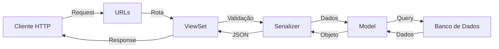
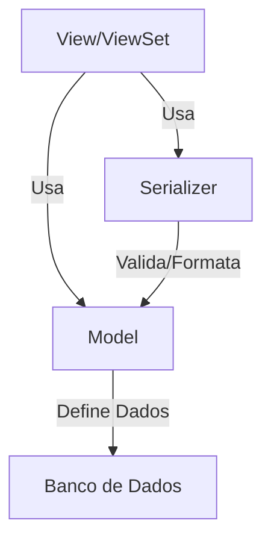

# 📐 Padrão de Desenvolvimento
# Padrões de Desenvolvimento - CIMFLEX

## Guia Visual

### Fluxo de uma Requisição API



### Estrutura MVC no Django



## Boas Práticas Visuais

| ✅ Fazer | ❌ Não Fazer |
| --- | --- |
| Usar pastas separadas para models, serializers, etc. | Colocar tudo em um único arquivo |
| Nomear arquivos de acordo com o padrão (customer.py) | Usar nomes genéricos (model.py) |
| Documentar com docstrings em português | Deixar código sem documentação |
| Criar factory para cada model | Criar dados de teste manualmente |
| Separar testes por categoria | Misturar diferentes tipos de teste |

## FAQ para Iniciantes

### 1\. Como começar um novo app?

```bash
# 1. Criar o app
poetry run python manage.py startapp nome_do_app

# 2. Criar a estrutura de pastas
mkdir nome_do_app/models nome_do_app/serializers nome_do_app/viewsets nome_do_app/tests

# 3. Criar arquivos iniciais
touch nome_do_app/models/__init__.py nome_do_app/models/nome_app.py
# ... repetir para outras pastas
```

### 2\. Como organizar os imports?

```python
# ✅ Forma correta
from .models import Customer  # Import relativo
from customers.models import Customer  # Import absoluto quando necessário

# ❌ Evitar
from ..models import *  # Import com asterisco
import customers.models.customer  # Import muito específico desnecessário
```

### 3\. Quando usar cada tipo de teste?

* **test_serializers/**: Para validações de dados e transformações
* **test_viewsets/**: Para endpoints da API e fluxos HTTP
* **test_models/**: Para regras de negócio e validações do modelo

## 1\. Estrutura de Apps

### 1.1 Um App por Tela

**Definição**: Cada tela principal do sistema deve ter seu próprio app Django.

**Motivação**:

* Melhor organização e separação de responsabilidades
* Facilita a manutenção e desenvolvimento paralelo
* Segue princípios do Clean Code

**Exemplo**:

```
cimflex_dj/
├── customers/           # App para tela de Clientes
├── representatives/     # App para tela de Representantes
└── products/           # App para tela de Produtos
```

### 1.2 Estrutura Interna dos Apps

Cada app deve seguir a seguinte estrutura:

```
app_name/                           # Exemplo: customers/
├── models/
│   ├── __init__.py
│   └── [nome_app_singular].py     # Exemplo: customer.py
├── serializers/
│   ├── __init__.py
│   └── [nome_app]_serializers.py  # Exemplo: customers_serializers.py
├── viewsets/
│   ├── __init__.py
│   └── [nome_app]_viewset.py      # Exemplo: customer_viewset.py
├── tests/
│   ├── test_serializers/
│   │   └── test_[nome_app]_serializer.py  # Exemplo: test_customer_serializer.py
│   └── test_viewsets/
│       └── test_[nome_app]_viewset.py     # Exemplo: test_customer_viewset.py
├── factories.py
└── urls.py
```

**Padrão de Nomenclatura dos Arquivos**:

* Models: usar substantivo no singular (customer.py, representative.py)
* Serializers: nome do app + '_serializers' (customers_serializers.py)
* Viewsets: nome do app + '_viewset' (customer_viewset.py)
* Testes: prefixo 'test_' + nome do componente testado (test_customer_serializer.py)

**Responsabilidades e Configuração**:

* `models/`:
  * Definições de modelos e lógica de dados
  * O `__init__.py` deve importar e expor os models:

    ```python
    # models/__init__.py
    from .customer import Customer
    ```
* `serializers/`:
  * Serialização de dados e validações
  * O `__init__.py` deve importar e expor os serializers:

    ```python
    # serializers/__init__.py
    from .customers_serializers import CustomerSerializer
    ```
* `viewsets/`:
  * Lógica de API e endpoints
  * O `__init__.py` deve importar e expor os viewsets:

    ```python
    # viewsets/__init__.py
    from .customer_viewset import CustomerViewSet
    ```
* `tests/`: Testes organizados por categoria
* `factories.py`: Factories para testes
* `urls.py`: Roteamento do app

**Importante**: Cada package Python (diretório com `__init__.py`) deve importar explicitamente seus módulos no `__init__.py`. Isso permite que outros módulos importem diretamente do package, mantendo o código mais limpo e organizado.

## 2\. Padrão de Código

### 2.1 Docstrings e Comentários

**Regras**:

* Usar docstrings em português
* Usar """ para docstrings de múltiplas linhas
* Usar # para comentários de linha única

**Exemplo**:

```python
class CustomerViewSet(ModelViewSet):
    """
    ViewSet para gerenciamento de clientes.
    
    Fornece operações CRUD básicas:
    - Listar clientes
    - Criar cliente
    - Atualizar cliente
    - Deletar cliente
    """
    
    # Configuração do serializer
    serializer_class = CustomerSerializer
```

### 2.2 Testes

#### Factory Boy

Sempre criar factories para os models:

```python
class CustomerFactory(factory.django.DjangoModelFactory):
    class Meta:
        model = Customer

    nome = factory.Faker("name")
    email = factory.Faker("email")
```

#### Estrutura de Testes

* Separar testes por categoria (serializers, viewsets)
* Usar TestCase apropriado (APITestCase para APIs)
* Nomear métodos de teste de forma descritiva

```python
def test_customer_serializer_validation(self):
    """Testa a validação dos campos do cliente"""
    # implementação
```

## 3\. API e Serializers

### 3.1 Versionamento

URLs devem incluir versão:

```python
re_path('cimflex/(?P<version>(v1|v2))/', include("app.urls"))
```

### 3.2 Serializers

* Criar um serializer para cada model
* Implementar validações necessárias
* Usar ModelSerializer quando possível

## 4\. Ferramentas e Utilitários

### 4.1 Django Extensions

Pacote instalado para auxiliar no desenvolvimento:

**Comandos Úteis**:

```bash
# Listar todas as URLs do projeto
poetry run python manage.py showurls

# Gerar diagrama de models
poetry run python manage.py graph_models -a -o models.png
```

### 4.2 Poetry

Gerenciador de dependências do projeto. Configuração básica via PyCharm conforme documentação existente.

## 5\. Boas Práticas

### 5.1 Imports

Organizar imports na seguinte ordem:

```python
# Biblioteca padrão
import os
from datetime import datetime

# Django e DRF
from django.db import models
from rest_framework import serializers

# Imports locais
from .models import Customer
```

### 5.2 Nomenclatura

* Apps: substantivos no plural (customers, products)
* Classes: CamelCase (CustomerSerializer)
* Métodos/Funções: snake_case (get_queryset)
* URLs: kebab-case (customer-detail)

## 6\. Checklist de Implementação

* [ ] Estrutura de diretórios correta
* [ ] Docstrings em todos os módulos principais
* [ ] Factories implementadas
* [ ] Testes para serializers e viewsets
* [ ] Validações necessárias
* [ ] URLs versionadas